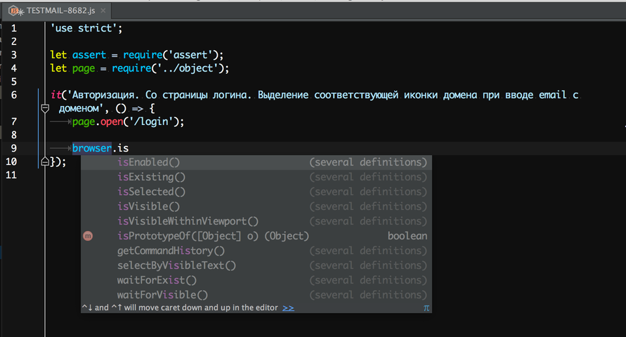

# wdio-api-declaration

> A [WebdriverIO API](http://webdriver.io/api.html) declaration.

This package helps to make your code editor aware of the functions and methods of the library without adding it's source code to the project, we need to set it as an External JavaScript library.

### Installation

```
npm install wdio-api-declaration
```

### Usage

For more information please see the article [How WebStorm Works: Completion for JavaScript Libraries](https://blog.jetbrains.com/webstorm/2014/07/how-webstorm-works-completion-for-javascript-libraries/)

